# Import/Export Flowchart Diagrams

Comprehensive Mermaid diagrams documenting all import/export paths, decision points, and crack points where users can get stuck or fail silently.

---

## Diagram 1: Complete Import/Export Flowchart

Master flowchart showing all paths agents and skills can take during export and import.


---

## Diagram 2: Agent Import Flow (Detailed)

Sequence diagram showing step-by-step agent import with error branching at each stage.

```mermaid
sequenceDiagram
    participant User as User
    participant CLI as Squad CLI
    participant Manifest as Import<br/>Manifest
    participant Local as Local .ai-team
    participant FS as File System
    
    User->>CLI: squad import agent-export.json
    activate CLI
    
    CLI->>FS: Check file exists?
    alt File Not Found
        FS-->>CLI: ❌ File not found
        CLI-->>User: ⚠️ CRACK: File not found
        deactivate CLI
    else File Exists
        FS-->>CLI: ✓ File found
        
        CLI->>Manifest: Parse JSON
        alt Parse Error
            Manifest-->>CLI: ❌ Invalid JSON
            CLI-->>User: ⚠️ CRACK: JSON parse failed
            deactivate CLI
        else Parse Success
            Manifest-->>CLI: ✓ Manifest loaded
            
            CLI->>Manifest: Validate schema
            alt Schema Invalid
                Manifest-->>CLI: ❌ Missing fields
                CLI-->>User: ⚠️ CRACK: Invalid export
                deactivate CLI
            else Schema Valid
                Manifest-->>CLI: ✓ Schema OK
                
                CLI->>Local: Check .ai-team/ exists?
                alt Exists (No --force)
                    Local-->>CLI: ❌ Collision detected
                    CLI-->>User: ⚠️ CRACK: Squad exists, use --force
                    deactivate CLI
                else Exists (--force flag)
                    Local-->>CLI: ✓ Archive current squad
                    CLI->>FS: Archive .ai-team → .ai-team-archive-{ts}
                    FS-->>CLI: ✓ Archived
                    
                    CLI->>Local: Create directory structure
                    FS-->>CLI: ✓ Dirs created
                    
                    CLI->>Local: Write casting state
                    alt Casting Write Error
                        FS-->>CLI: ⚠️ Partial write
                        CLI-->>User: ⚠️ WARNING: Casting incomplete
                    else Casting Write OK
                        FS-->>CLI: ✓ Casting written
                    end
                    
                    CLI->>Manifest: Extract agent metadata
                    Manifest-->>CLI: agent: {charter, history}
                    
                    CLI->>Local: Write charter.md
                    FS-->>CLI: ✓ Charter written
                    
                    CLI->>CLI: Split history:<br/>Portable ↔ Project Learnings
                    CLI->>Local: Write history.md<br/>(with import timestamp)
                    alt History Parse Error
                        FS-->>CLI: ⚠️ History split failed
                        CLI-->>User: ⚠️ CRACK: Some history lost
                    else History OK
                        FS-->>CLI: ✓ History written
                    end
                    
                    CLI->>Local: Create agent folder structure
                    FS-->>CLI: ✓ Folder created
                    
                    CLI->>Local: Update team.md (if needed)
                    CLI->>Local: Update routing.md (if needed)
                    FS-->>CLI: ✓ Config updated
                    
                    CLI->>User: ✓ SUCCESS<br/>Agent imported<br/>Next: Open Copilot & tell Squad
                    deactivate CLI
                else No .ai-team
                    CLI->>FS: Create new .ai-team
                    FS-->>CLI: ✓ Created
                    
                    CLI->>Local: Write casting state
                    FS-->>CLI: ✓ Casting written
                    
                    CLI->>Manifest: Extract agent metadata
                    Manifest-->>CLI: agent: {charter, history}
                    
                    CLI->>Local: Write charter.md
                    FS-->>CLI: ✓ Charter written
                    
                    CLI->>CLI: Split history
                    CLI->>Local: Write history.md
                    FS-->>CLI: ✓ History written
                    
                    CLI->>User: ✓ SUCCESS<br/>Agent imported
                    deactivate CLI
                end
            end
        end
    end
```

---

## Diagram 3: Skill Import Flow (Detailed)

Similar to agent import but with skill-specific handling: confidence levels, domain conflicts, and marketplace integration.

```mermaid
graph TD
    SkillStart(["User: squad skill import<br/>{source}"])
    
    subgraph SkillDiscovery["SKILL DISCOVERY"]
        SkillStart --> SourceType{{"Source type?"}}
        SourceType -->|Registry| RegResolve["Resolve from<br/>default marketplace<br/>bradygaster/squad-places"]
        SourceType -->|Custom URL| CustomResolve["Resolve from<br/>custom marketplace"]
        SourceType -->|Direct Path| DirectResolve["Load from<br/>local file path"]
        
        RegResolve --> Browse["⚠️ Browse marketplace<br/>or use direct reference"]
        CustomResolve --> SkillSource["Construct SkillSource:<br/>url + ref + path"]
        DirectResolve --> SkillSource
        Browse --> SkillSource
    end
    
    subgraph SkillValidation["SKILL VALIDATION"]
        SkillSource --> FetchSkill["Fetch SKILL.md<br/>from source"]
        FetchSkill --> FetchErr{{"Fetch<br/>succeeded?"}}
        FetchErr -->|No| SkillCrack1["⚠️ CRACK POINT<br/>Network error OR<br/>file not found at source"]
        FetchErr -->|Yes| ParseSkill["Parse SKILL.md<br/>metadata"]
        
        ParseSkill --> SkillName["Extract: name<br/>description<br/>domain<br/>version<br/>depends_on"]
        SkillName --> ValidateField{{"All required<br/>fields exist?"}}
        ValidateField -->|No| SkillCrack2["⚠️ CRACK POINT<br/>Malformed SKILL.md<br/>missing name or domain"]
        ValidateField -->|Yes| SkillReady["✓ Skill metadata OK"]
    end
    
    subgraph SkillConflict["CONFLICT DETECTION"]
        SkillReady --> ConflictCheck{{"Skill with same<br/>name exists<br/>locally?"}}
        ConflictCheck -->|Yes| DomainCheck{{"Different<br/>domain?"}}
        DomainCheck -->|No| SkillCrack3["⚠️ CRACK POINT<br/>Name collision<br/>Skill already imported<br/>Rename on import OR skip"]
        DomainCheck -->|Yes| CoexistWarn["⚠️ WARNING<br/>Two skills for same domain<br/>Routing will use first-listed"]
        ConflictCheck -->|No| Ready2["✓ No collision"]
        
        CoexistWarn --> Ready2
    end
    
    subgraph SkillConfidence["CONFIDENCE LEVEL"]
        Ready2 --> ConfLevel["Set initial confidence<br/>to LOW<br/>(security policy:<br/>imported = untrusted)"]
        ConfLevel --> ConfMeta["Add metadata:<br/>source={ref}<br/>imported_at={timestamp}<br/>confidence=low"]
    end
    
    subgraph SkillWrite["WRITE TO LOCAL"]
        ConfMeta --> Deps{{"Skill has<br/>dependencies?"}}
        Deps -->|Yes| DepCheck["Check: are<br/>dependencies<br/>available locally?"]
        DomainCheck1{{"Unresolved<br/>deps?"}}
        DepCheck --> DomainCheck1
        DomainCheck1 -->|Yes| SkillCrack4["⚠️ CRACK POINT<br/>Unmet dependency<br/>Skill requires another skill<br/>not found locally"]
        DomainCheck1 -->|No| Write
        Deps -->|No| Write["Write to<br/>skills/{skill-name}/"]
        
        Write --> WriteDir["Create skills/{skill-name}/<br/>SKILL.md<br/>manifest.json"]
        WriteDir --> WriteErr{{"Write<br/>succeeded?"}}
        WriteErr -->|No| SkillCrack5["⚠️ CRACK POINT<br/>File write failed<br/>Disk error or<br/>permissions"]
        WriteErr -->|Yes| UpdateSDK["Update SDK skillDirectories<br/>to include new skill"]
        
        UpdateSDK --> SDKErr{{"SDK config<br/>update OK?"}}
        SDKErr -->|No| SkillCrack6["⚠️ CRACK POINT<br/>SDK not aware of skill<br/>Skill registered but<br/>not available to Copilot"]
        SDKErr -->|Yes| SkillSuccess["✓ SUCCESS<br/>Skill imported at low confidence"]
    end
    
    SkillCrack1 --> SkillEnd
    SkillCrack2 --> SkillEnd
    SkillCrack3 --> SkillEnd
    SkillCrack4 --> SkillEnd
    SkillCrack5 --> SkillEnd
    SkillCrack6 --> SkillEnd
    SkillSuccess --> SkillNextSteps["Next steps:<br/>1. Test skill in Copilot<br/>2. Use it 2+ times<br/>→ confidence: medium<br/>3. Use 5+ times<br/>→ confidence: high"]
    SkillNextSteps --> SkillEnd(["Done"])
    
    classDef crack fill:#FF6B6B,stroke:#CC3333,color:#fff,font-weight:bold
    classDef warning fill:#FFB800,stroke:#FF9500,color:#000,font-weight:bold
    classDef success fill:#7ED321,stroke:#5FA215,color:#fff,font-weight:bold
    classDef decision fill:#4A90E2,stroke:#2E5C8A,color:#fff
    classDef process fill:#E8E8E8,stroke:#666,color:#000
    
    class SkillCrack1,SkillCrack2,SkillCrack3,SkillCrack4,SkillCrack5,SkillCrack6 crack
    class CoexistWarn warning
    class SkillSuccess success
    class SourceType,FetchErr,ValidateField,ConflictCheck,DomainCheck,Deps,DomainCheck1,WriteErr,SDKErr decision
```



---

## Diagram 4: Export/Publish Flow

How an agent or skill moves from local squad to registry/marketplace.

```mermaid
graph LR
    Start(["User: squad export<br/>--publish"])
    
    subgraph LocalPrep["LOCAL PREP"]
        Start --> Check{"Check:<br/>.ai-team/<br/>exists?"}
        Check -->|No| Fail1["❌ FATAL<br/>No squad found"]
        Check -->|Yes| Validate["Validate export:<br/>- agents present?<br/>- skills present?<br/>- casting defined?"]
        
        Validate --> ValidErr{{"Valid for<br/>export?"}}
        ValidErr -->|No| Fail2["⚠️ CRACK POINT<br/>Cannot export<br/>empty squad or<br/>missing metadata"]
        ValidErr -->|Yes| Package["Package manifest:<br/>charter.md<br/>history.md<br/>SKILL.md<br/>casting state"]
    end
    
    subgraph History["HISTORY HANDLING"]
        Package --> HistoryReview["Review agent histories<br/>for project-specific info"]
        HistoryReview --> HistorySplit["Option 1: Auto-split<br/>portable ↔ private<br/>OR<br/>Option 2: Manual review<br/>& redaction"]
        HistorySplit --> Approved["✓ Approved for export<br/>(histories cleaned)"]
    end
    
    subgraph Naming["NAMING CONVENTIONS"]
        Approved --> AgentName{"Agent name<br/>follows<br/>pattern?"}
        AgentName -->|No| Fail3["⚠️ CRACK POINT<br/>Naming violation<br/>Must match: [a-z0-9-]<br/>3–50 chars"]
        AgentName -->|Yes| Version["Tag version:<br/>Commit SHA<br/>or semantic"]
    end
    
    subgraph Registry["REGISTRY PUSH"]
        Version --> Auth{"GitHub token<br/>available<br/>& valid?"}
        Auth -->|No| Fail4["⚠️ CRACK POINT<br/>Auth failed<br/>Run: gh auth login"]
        Auth -->|Yes| Push["Push to registry<br/>bradygaster/squad-places<br/>agents/{github_user}/{agent_name}/"]
        
        Push --> PushErr{{"Push<br/>succeeded?"}}
        PushErr -->|No| Fail5["⚠️ CRACK POINT<br/>Network error OR<br/>registry unavailable<br/>Check connectivity"]
        PushErr -->|Yes| UpdateRef["Update remote ref:<br/>agents/{name}/HEAD<br/>→ {commit_sha}"]
    end
    
    subgraph Marketplace["MARKETPLACE"]
        UpdateRef --> MktList{{"Publish to<br/>marketplace<br/>listing?"}}
        MktList -->|No| Done1["✓ Exported only<br/>Direct share:git clone"]
        MktList -->|Yes| Metadata["Add marketplace metadata:<br/>- description<br/>- tags<br/>- icon<br/>- readme"]
        
        Metadata --> MktSubmit["Submit to marketplace<br/>for review"]
        MktSubmit --> MktReview{{"Marketplace<br/>review OK?"}}
        MktReview -->|No| Fail6["⚠️ CRACK POINT<br/>Marketplace rejection<br/>Fix & resubmit"]
        MktReview -->|Yes| MktLive["✓ LISTED<br/>Users can browse<br/>& import"]
    end
    
    Fail1 --> End
    Fail2 --> End
    Fail3 --> End
    Fail4 --> End
    Fail5 --> End
    Fail6 --> End
    Done1 --> End(["Done"])
    MktLive --> End
    
    classDef crack fill:#FF6B6B,stroke:#CC3333,color:#fff,font-weight:bold
    classDef success fill:#7ED321,stroke:#5FA215,color:#fff,font-weight:bold
    classDef decision fill:#4A90E2,stroke:#2E5C8A,color:#fff
    classDef process fill:#E8E8E8,stroke:#666,color:#000
    
    class Fail1,Fail2,Fail3,Fail4,Fail5,Fail6 crack
    class Done1,MktLive success
    class Check,ValidErr,AgentName,Auth,PushErr,MktList,MktReview decision
```



---

## Diagram 5: Update/Upgrade Flow

What happens when new versions of imported agents become available.

```mermaid
graph TD
    Check(["User: squad places check"])
    
    subgraph Detection["UPDATE DETECTION"]
        Check --> Auth{"GitHub token<br/>available?"}}
        Auth -->|No| Fail1["⚠️ CRACK POINT<br/>Cannot check for updates<br/>gh auth login"]
        Auth -->|Yes| Local["Read local agents<br/>& pinned SHAs"]
        
        Local --> Remote["Query remote HEAD<br/>for each agent source"]
        Remote --> NetErr{{"Network<br/>reachable?"}}
        NetErr -->|No| Offline["⚠️ OFFLINE MODE<br/>Use cached versions<br/>Warn: cannot check updates"]
        NetErr -->|Yes| Compare["Compare:<br/>local SHA vs<br/>remote HEAD"]
        
        Offline --> Updates{{"Updates<br/>available?"}}
        Compare --> Updates
    end
    
    subgraph Preview["DIFF PREVIEW"]
        Updates -->|No| UpToDate["✓ All agents current"]
        Updates -->|Yes| Fetch["Fetch remote agent<br/>charter + history"]
        
        Fetch --> FetchErr{{"Fetch<br/>succeeded?"}}
        FetchErr -->|No| Fail2["⚠️ CRACK POINT<br/>Cannot fetch remote<br/>Check network"]
        FetchErr -->|Yes| Diff["Generate diff:<br/>Local charter ↔<br/>Remote charter"]
        
        Diff --> Preview["Show preview:<br/>What changed?<br/>New behaviors?<br/>Breaking changes?"]
    end
    
    subgraph Decision["USER DECISION"]
        Preview --> Decide{{"User<br/>action?"}}
        Decide -->|Skip| Done1["✓ OK<br/>Agent stays pinned"]
        Decide -->|Upgrade<br/>--force| GetReady["Prepare upgrade"]
        Decide -->|Inspect<br/>--local| OpenEditor["Open remote agent<br/>in editor<br/>for manual review"]
        
        OpenEditor --> ReadyAfter["Decide after review"]
        ReadyAfter --> Decide
    end
    
    subgraph Upgrade["UPGRADE EXECUTION"]
        GetReady --> Backup["Backup current agent:<br/>agents/{name} →<br/>agents/{name}.backup-{ts}"]
        
        Backup --> GetNew["Download new version<br/>charter.md<br/>history.md"]
        
        GetNew --> History{{"Preserve local<br/>history?"}}
        History -->|Yes| Merge["Merge histories:<br/>Local learnings +<br/>Remote updates<br/>(new entries marked)"]
        History -->|No| Fresh["Replace with remote<br/>history"]
        
        Merge --> Update["Update agent folder:<br/>- charter.md<br/>- merged history.md"]
        Fresh --> Update
        
        Update --> UpdateErr{{"Update<br/>succeeded?"}}
        UpdateErr -->|No| Fail3["⚠️ CRACK POINT<br/>Update failed<br/>Rollback available"]
        UpdateErr -->|Yes| Complete["✓ UPGRADED<br/>New SHA pinned"]
    end
    
    subgraph Rollback["ROLLBACK"]
        Fail3 --> RollAsk{{"Rollback?"}}
        RollAsk -->|No| Stuck["⚠️ Agent in<br/>partially updated state<br/>Manual intervention<br/>needed"]
        RollAsk -->|Yes| Restore["Restore from backup:<br/>agents/{name}.backup<br/>→ agents/{name}"]
        
        Restore --> RestoreErr{{"Restore<br/>OK?"}}
        RestoreErr -->|No| Fail4["⚠️ CRACK POINT<br/>Rollback failed<br/>Manual recovery required"]
        RestoreErr -->|Yes| RollbackOK["✓ Rolled back<br/>Agent back to<br/>previous state"]
    end
    
    UpToDate --> End
    Done1 --> End
    Complete --> End
    RollbackOK --> End
    Stuck --> End
    Fail1 --> End
    Fail2 --> End
    Fail4 --> End(["Done"])
    
    classDef crack fill:#FF6B6B,stroke:#CC3333,color:#fff,font-weight:bold
    classDef warning fill:#FFB800,stroke:#FF9500,color:#000,font-weight:bold
    classDef success fill:#7ED321,stroke:#5FA215,color:#fff,font-weight:bold
    classDef decision fill:#4A90E2,stroke:#2E5C8A,color:#fff
    
    class Fail1,Fail2,Fail3,Fail4,Stuck crack
    class Offline warning
    class UpToDate,Done1,Complete,RollbackOK success
    class Auth,NetErr,Updates,FetchErr,Decide,History,UpdateErr,RollAsk,RestoreErr decision
```

---

## Diagram 6: Error Recovery Map

State diagram showing all "stuck" states users can fall into and how to recover.

```mermaid
stateDiagram-v2
    [*] --> Healthy: Squad<br/>Healthy
    
    Healthy --> AuthExpired: gh CLI<br/>token expires
    Healthy --> NoSquad: .ai-team/<br/>missing
    Healthy --> PartialImport: Import<br/>interrupted
    Healthy --> NameCollision: Import<br/>agent exists
    Healthy --> VersionMismatch: Casting<br/>mismatch
    Healthy --> NoCache: Offline<br/>no cache
    Healthy --> StaleCache: Cache<br/>outdated
    Healthy --> CircDeps: Circular<br/>dependency
    
    AuthExpired --> AuthRecovery: Run:<br/>gh auth login
    AuthRecovery --> Healthy: ✓ Re-auth<br/>complete
    
    NoSquad --> NoSquadRecovery: Run:<br/>squad init
    NoSquadRecovery --> Healthy: ✓ Squad<br/>created
    
    PartialImport --> PIAnalyze: Check .ai-team/<br/>for partial files
    PIAnalyze --> PIClean: rm -rf .ai-team<br/>OR<br/>squad import<br/>--force
    PIClean --> Healthy: ✓ Clean<br/>import
    
    NameCollision --> NCHandle{{"Choose<br/>path"}}
    NCHandle --> NCRename: Rename<br/>incoming agent<br/>before import
    NCRename --> Healthy: ✓ Renamed<br/>agent imported
    NCHandle --> NCForce: squad import<br/>--force<br/>⚠️ Archives old
    NCForce --> Healthy: ✓ Replaced<br/>old agent
    
    VersionMismatch --> VMAnalyze: Compare<br/>local policy.json<br/>vs remote
    VMAnalyze --> VMUpgrade: squad places<br/>upgrade {agent}
    VMUpgrade --> Healthy: ✓ Upgraded
    VMAnalyze --> VMManual: Manual policy<br/>update
    VMManual --> Healthy: ✓ Policy<br/>adjusted
    
    NoCache --> NCAnalyze: Check:<br/>Network issue?<br/>Or deleted<br/>from registry?
    NCAnalyze --> NCNetwork: Fix network<br/>connectivity
    NCNetwork --> Healthy: ✓ Connected
    NCAnalyze --> NCForce2: Use<br/>--offline flag<br/>to skip checks
    NCForce2 --> PartialFunction: ⚠️ Squad runs<br/>in degraded mode
    PartialFunction --> Healthy: Once network<br/>restored
    
    StaleCache --> SCCheck: Run:<br/>squad places check
    SCCheck --> SCUpgrade: Review diffs<br/>squad places<br/>upgrade
    SCUpgrade --> Healthy: ✓ Updated
    SCCheck --> SCIgnore: Ignore<br/>updates<br/>stay on current
    SCIgnore --> Healthy: ✓ Pinned
    
    CircDeps --> CDAnalyze: Map agent<br/>dependencies<br/>Identify cycle
    CDAnalyze --> CDBreak: Remove import<br/>of one agent<br/>in cycle
    CDBreak --> Healthy: ✓ Dependency<br/>resolved
    CDAnalyze --> CDReorder: Reorder imports<br/>in config<br/>to resolve
    CDReorder --> Healthy: ✓ Resolved
    
    note right of Healthy
        All systems normal
        Agents loaded
        Skills available
    end note
    
    note right of AuthExpired
        Cannot reach registry
        Cannot check updates
        Cannot import/export
    end note
    
    note right of NoSquad
        Cannot run squad
        No agents available
        No casting state
    end note
    
    note right of PartialImport
        .ai-team/ exists
        but incomplete
        Some agents missing
    end note
    
    note right of NameCollision
        Incoming agent
        has same name
        as local agent
    end note
    
    note right of VersionMismatch
        Local casting.policy
        incompatible with
        imported agent
    end note
    
    note right of NoCache
        Remote unreachable
        No local copy cached
        Agents unavailable
    end note
    
    note right of StaleCache
        Remote has new version
        Local still using old
        Updates available
    end note
    
    note right of CircDeps
        Agent A imports B
        Agent B imports A
        Creates loop
    end note
```

---

## Crack Point Summary

### Critical Failures (Can't Continue)

| Crack Point | Symptom | User Action | Prevention |
|---|---|---|---|
| **No .ai-team** | `Fatal: No squad found — run init first` | Run `squad init` | Documentation |
| **File not found** | `Fatal: Import file not found` | Check path, verify export | Clear CLI feedback |
| **Invalid JSON** | `Fatal: Invalid JSON in import file` | Verify export file integrity | Better export validation |
| **Invalid schema** | `Fatal: Missing required fields` | Re-export, check version | Schema versioning |
| **Squad collision** | `Fatal: Squad exists, use --force` | Use `--force` or rm .ai-team | Clear messaging |
| **Write failed** | `Fatal: Failed to write export file` | Check disk space, permissions | Pre-flight checks |
| **Auth expired** | `Cannot reach registry` | Run `gh auth login` | Token refresh logic |
| **File write error** | `Skill/agent not written to disk` | Check disk space, re-import | Disk pre-flight check |

### Degraded States (Partial Success)

| Crack Point | Symptom | User Impact | Recovery |
|---|---|---|---|
| **Partial history split** | Agent imports but some history lost | Project learnings incomplete | Check .ai-team/agents/{name}/history.md |
| **Some skills fail** | Squad imports but skill subset missing | Incomplete skill coverage | Re-import individual skills |
| **Missing dependencies** | Skill imported but unmet dependencies | Skill unusable, won't load in SDK | Import missing skill first |
| **SDK not aware** | Skill registered locally but not to Copilot | Skill invisible, can't be used | Update skillDirectories config |
| **Stale cache** | Offline using old agent version | Potential behavior differences | Update when network available |

### Silent Failures (User May Not Notice)

| Crack Point | Symptom | Detection | Prevention |
|---|---|---|---|
| **History partially redacted** | Project learnings silently dropped | Manual review of history.md | Flag/warn on redaction |
| **Agent registered but not loaded** | Agent in team.md but not in SDK | Try to use agent → not available | Schema validation on write |
| **Skill available but hidden** | Low-confidence skill not offered | Explicit list of low-conf skills | Visible confidence indicator |
| **Circular dependency undetected** | Agent A → B → A | Agents fail to load | Dependency validation before import |

---

## Data Loss / Integrity Risks

### Export Phase

- **Risk:** User exports, then manually edits agent charter locally, expecting re-export to have both old + new
- **Reality:** Export reads current disk state; if history was already split, project learnings won't be in export
- **Mitigation:** Clear warning that export is point-in-time snapshot

### Import Phase

- **Risk:** Using `--force` on existing squad archives the old one but user doesn't realize
- **Reality:** Archive stored as `.ai-team-archive-{timestamp}`; if timestamp is seconds off, user might import twice and lose data
- **Mitigation:** Confirm archive location in output; keep last 3 archives before cleanup

### History Split

- **Risk:** Regex-based history split accidentally drops important portable knowledge
- **Reality:** splitHistory() function is heuristic; complex Markdown might confuse it
- **Mitigation:** Mark split boundaries clearly; provide manual override

---

## Diagram Legend

| Symbol | Meaning |
|--------|---------|
| 🟢 **Success node** | Operation completed successfully |
| 🔴 **Crack Point** (red) | Fatal error; user stuck; must intervene |
| 🟡 **Warning** (orange) | Degraded state; operation continues but data/function incomplete |
| 🔵 **Decision node** (blue) | Conditional branch; outcome depends on state |
| ⚠️ Prefix | Indicates user-visible warning or error message |
