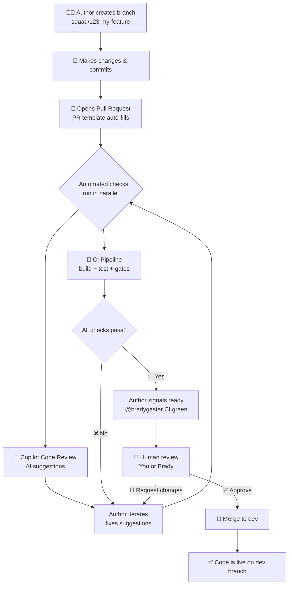
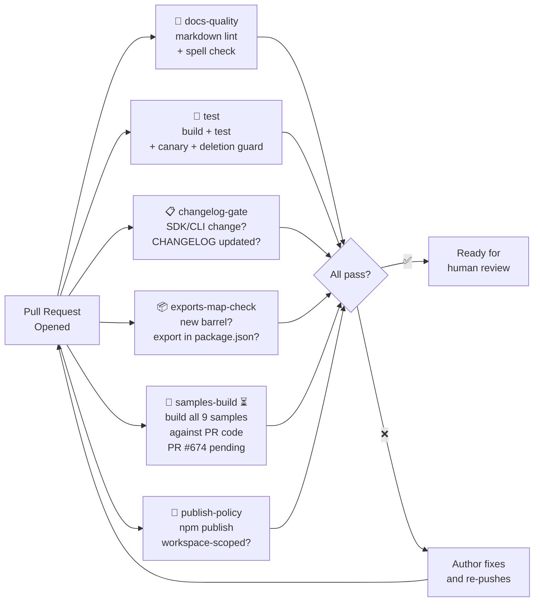
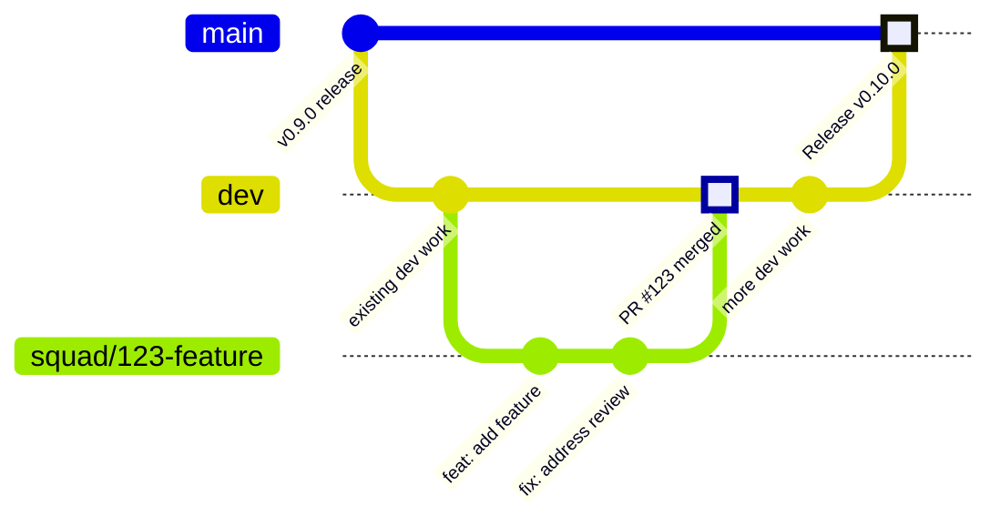
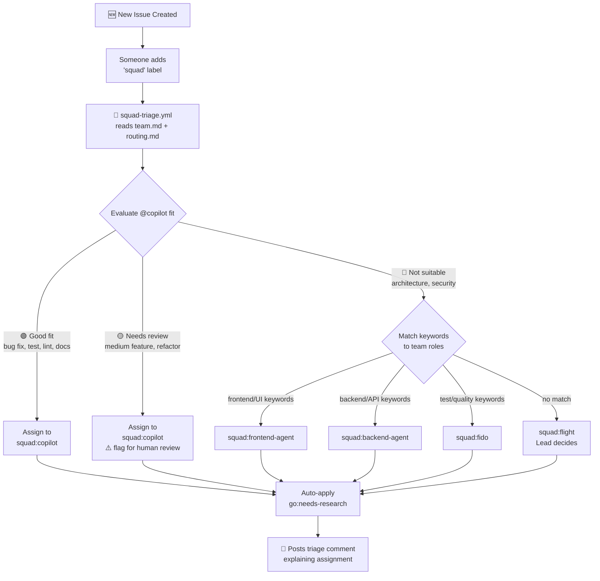
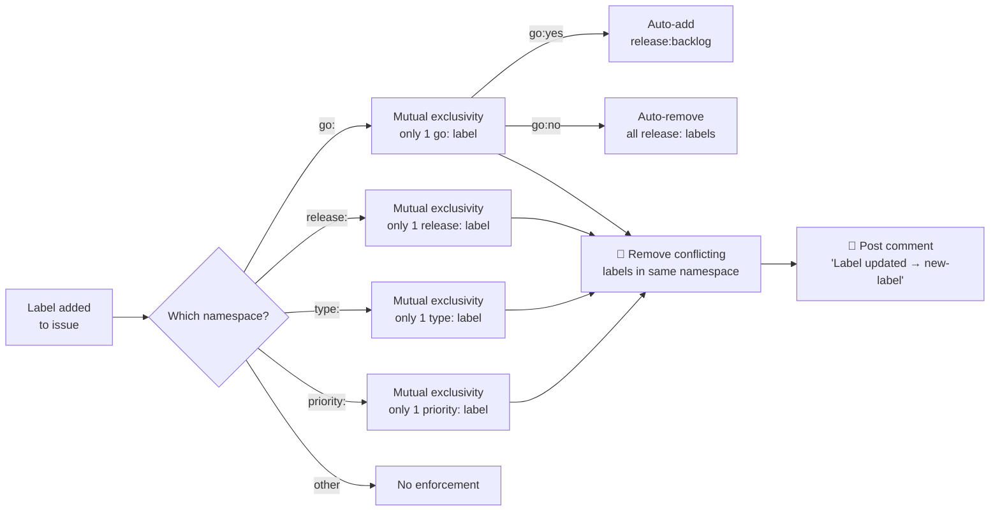
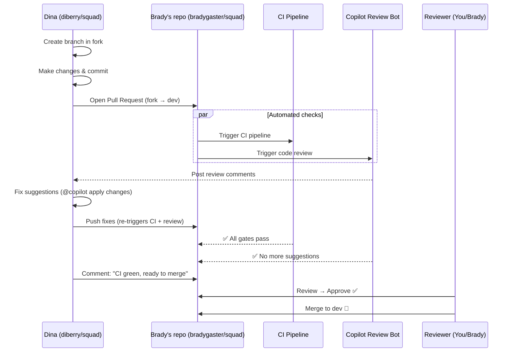

# 🏗️ Squad Repo — Complete GitHub & Workflow Guide

> **For the team chat** — Everything you need to know about how `bradygaster/squad` works, the guardrails we have, and how contributions flow.

---

## Visual Overview

### PR Lifecycle (Start to Finish)



### CI Pipeline — All Gates



### Branch & Merge Strategy



### Issue Triage Flow



### Label Namespace Enforcement



### Escape Hatches — How to Bypass Gates

```mermaid
flowchart TD
    GATE[CI Gate Fails ❌] --> CHOICE{How to bypass?}
    
    CHOICE -->|Per-PR| LABEL[Add skip label\nto this PR only]
    CHOICE -->|Global| FLAG[Set repo variable\nto 'false' — all PRs]
    
    LABEL --> L1[skip-changelog]
    LABEL --> L2[skip-exports-check]
    LABEL --> L3[skip-samples-ci\n(planned — #103)]
    LABEL --> L4[large-deletion-approved]
    
    FLAG --> F1[SQUAD_CHANGELOG_CHECK]
    FLAG --> F2[SQUAD_EXPORTS_CHECK]
    FLAG --> F3["SQUAD_SAMPLES_CI\n(planned — #103)"]
    
    L1 & L2 & L3 & L4 --> RULE[⚠️ Rule: Self-waiving\nnot allowed — another\nreviewer must agree]
    F1 & F2 & F3 --> OWNER[🔒 Only repo owner\nBrady can change]
```

### Fork Contribution Workflow



---

## Chapter 1: The People and Their Roles

| Person | GitHub Handle | Role | What They Can Do |
|--------|--------------|------|-----------------|
| **Brady** | `bradygaster` | Owner | Full control — settings, merge, delete, everything |
| **You (Tamir)** | `tamirdresher` | Collaborator | Review PRs, approve PRs, push branches, add labels |
| **Dina** | `diberry` | Collaborator (works from fork) | Opens PRs from her fork `diberry/squad` |
| **Copilot Bot** | `copilot-pull-request-reviewer[bot]` | AI Reviewer | Auto-reviews every PR with code suggestions |

---

## Chapter 2: Branches — The Parallel Versions of Code

A **branch** is like making a copy of a document to try edits without messing up the original. The repo has these key branches:

```
main ← stable release branch (production-ready code)
  ↑
dev  ← active development branch (all PRs merge here)
  ↑
squad/123-my-feature ← individual work branches (one per PR)
```

### Branch Protection
| Branch | Protected? | What It Means |
|--------|-----------|---------------|
| `dev` | ✅ Yes | Nobody can push directly — all changes must go through a PR |
| `main` | ✅ Yes | Same — PRs required |
| `insider` | ❌ No | Can push directly |
| Feature branches (`squad/*`) | ❌ No | Can push directly |

### Branch Naming Convention
All feature branches follow: `squad/{issue-number}-{brief-description}`
Example: `squad/104-pr-completeness-gates-upstream`

---

## Chapter 3: The Fork Workflow — How Dina Contributes

A **fork** is a personal copy of the entire repo. Dina has her own at `diberry/squad`.

```
Step 1: Dina's fork starts as a copy of Brady's repo
Step 2: She creates a branch in her fork
Step 3: She makes changes and commits them
Step 4: She opens a Pull Request:
         FROM: diberry/squad → TO: bradygaster/squad:dev
Step 5: PR appears on Brady's repo for review
Step 6: After approval → Brady (or you) merge it
```

**Why fork?** It gives contributors their own sandbox — they can't accidentally break the main repo.

---

## Chapter 4: What Happens When a PR Is Opened

The moment someone opens a PR, three things happen automatically:

### 4a. The PR Template Fills In

The file `.github/PULL_REQUEST_TEMPLATE.md` is a GitHub feature — it auto-fills every new PR with a structured form:

```markdown
### What       ← what does this PR change?
### Why        ← what problem does it solve? Link to issue: Closes #N
### How        ← approach, design decisions
### Testing    ← [ ] npm run build passes / [ ] npm test passes
### Docs       ← [ ] CHANGELOG entry / [ ] README / [ ] Docs page
### Exports    ← [ ] package.json exports updated (if new module)
### Breaking Changes
### Waivers    ← if skipping any rule, document why
```

### 4b. CI Pipeline Kicks Off

GitHub Actions reads `.github/workflows/squad-ci.yml` and runs automated checks. Think of it as a factory inspection line — code goes through multiple checkpoints.

### 4c. Copilot Code Review Bot Reviews

The AI reviewer reads the code diff and leaves suggestions. Dina's workflow with it:
1. Opens PR → Copilot reviews → leaves comments
2. She replies `@copilot apply changes` → Copilot fixes its own findings
3. Copilot re-reviews → repeat until clean
4. She pings: "@bradygaster Copilot is happy"

---

## Chapter 5: The CI Pipeline — Every Automated Check

### ✅ Already in the repo:

| CI Job | What It Checks |
|--------|---------------|
| **`docs-quality`** | Markdown formatting (`markdownlint`) + spell check (`cspell`) on `docs/src/content/**/*.md` and `README.md` |
| **`test`** | `npm install` → `npm run build` → `npm test` |
| **`🔒 Source tree canary`** | Verifies 4 critical files still exist (catches accidental deletion) |
| **`🔒 Large deletion guard`** | Blocks PRs that delete >50 files (unless `large-deletion-approved` label) |
| **`publish-policy`** | All `npm publish` commands must use workspace flag (`-w`) |

### 🆕 Added by Dina (PR #673 — pending merge):

| CI Job | What It Checks | PR |
|--------|---------------|-----|
| **`changelog-gate`** | If you change SDK/CLI source, you MUST update CHANGELOG.md | #673 (⏳ pending merge) |
| **`exports-map-check`** | New `src/*/index.ts` barrels must have matching `package.json` exports | #673 (⏳ pending merge) |
| **`samples-build`** | Builds all 9 sample projects against your PR's SDK code | #674 (⏳ pending merge) |

---

## Chapter 6: Feature Flags (Global On/Off Switches)

These are **repo variables** set in GitHub Settings. Only Brady can change them. They turn CI checks on/off for ALL PRs.

| Variable | Controls | Default | Set to `"false"` to disable |
|----------|---------|---------|----------------------------|
| `SQUAD_CHANGELOG_CHECK` | CHANGELOG gate | ✅ On | Skips CHANGELOG requirement globally |
| `SQUAD_EXPORTS_CHECK` | Exports map check | ✅ On | Skips exports check globally |
| `SQUAD_SAMPLES_CI` | Samples build (planned — #103) | N/A | Future flag; safe to ignore for now |

**How they work**: If the variable doesn't exist → check is ON. You must explicitly set it to `"false"` to disable.

---

## Chapter 7: PR Skip Labels (Per-PR Overrides)

**Labels** are tags on a specific PR. Unlike feature flags (global), these only affect one PR.

| Label | Skips | When to Use |
|-------|-------|-------------|
| `skip-changelog` | CHANGELOG gate | CI/infra-only changes that don't need a changelog entry |
| `skip-exports-check` | Exports map check | Missing export is intentional or tracked separately |
| `skip-samples-ci` | Samples build (planned — #103) | Not yet active; reserved for when samples CI gate ships |
| `large-deletion-approved` | Deletion guard (>50 files) | Intentional mass refactors or migrations |

⚠️ **Rule: Self-waiving is not allowed.** Another reviewer must agree before you add a skip label.

---

## Chapter 8: Issue Labels — The Triage System

The repo has an automated label system synced from `.squad/team.md`. Labels are organized into **namespaces** — only ONE label per namespace allowed on an issue. A robot (`squad-label-enforce.yml`) auto-removes conflicts.

### `go:` — Triage Verdict (should we do this?)
| Label | Meaning | Auto-behavior |
|-------|---------|---------------|
| `go:yes` | ✅ Ready to implement | Auto-adds `release:backlog` if no release target |
| `go:no` | ❌ Not pursuing | Auto-removes any `release:` labels |
| `go:needs-research` | 🟡 Needs investigation first | Default when triaged |

### `release:` — Release Target
| Label | Meaning |
|-------|---------|
| `release:v0.4.0` — `release:v1.0.0` | Targeted for that release |
| `release:backlog` | Accepted but not yet targeted |

### `type:` — Issue Type
| Label | Meaning |
|-------|---------|
| `type:feature` | New capability |
| `type:bug` | Something broken |
| `type:spike` | Research — produces a plan, not code |
| `type:docs` | Documentation |
| `type:chore` | Maintenance, refactoring, cleanup |
| `type:epic` | Parent issue with sub-issues |

### `priority:` — Priority
| Label | Meaning |
|-------|---------|
| `priority:p0` | 🔴 Blocking release |
| `priority:p1` | 🟠 This sprint |
| `priority:p2` | 🟡 Next sprint |

### `squad:` — Assignment
| Label | Meaning |
|-------|---------|
| `squad` | Triage inbox — triggers the auto-triage robot |
| `squad:copilot` | Assigned to @copilot AI coding agent |
| `squad:{member}` | Assigned to a specific team member |

---

## Chapter 9: The Auto-Triage System

When someone adds the `squad` label to an issue, the `squad-triage.yml` workflow:

1. Reads `.squad/team.md` for the team roster
2. Reads `.squad/routing.md` for routing rules
3. Analyzes the issue title + body for keywords
4. Evaluates @copilot fit using a **3-tier system**:
   - 🟢 **Good fit** (bug fix, test coverage, lint, doc fix) → auto-assigns to `squad:copilot`
   - 🟡 **Needs review** (medium feature, refactoring) → assigns to `squad:copilot` + flags for human review
   - 🔴 **Not suitable** (architecture, security, auth) → routes to a human team member
5. Falls back to the Lead if nothing matches
6. Posts a triage comment explaining the assignment

---

## Chapter 10: The PR Requirements Spec — The Rulebook

`.github/PR_REQUIREMENTS.md` defines 6 categories of requirements:

### (a) Git Hygiene — REQUIRED, automated
- Reference issue numbers in commits (`Closes #123`)
- No junk files (node_modules, .DS_Store, build output)
- No unrelated file changes
- No force-pushes to `dev` or `main`

### (b) CI/Build — REQUIRED, automated
- `npm run build` passes
- `npm test` passes
- No new warnings without explanation

### (c) Code Quality — REQUIRED, manual + automated
- Public APIs have JSDoc comments
- No lint/type errors
- Tests for all new functionality

### (d) Documentation — REQUIRED for user-facing changes, manual
- CHANGELOG.md entry (Keep-a-Changelog format)
- README updates for new features
- Docs page for new capabilities

### (e) Package/Exports — REQUIRED for new modules, manual + automated
- `package.json` exports updated for new modules
- No accidental dependency additions
- No export regressions

### (f) Samples — REQUIRED when API changes, manual + automated
- Update samples if APIs change
- New features need at least one sample

### What's "User-Facing"?
- Changes to `packages/squad-sdk/src/` (SDK code users import)
- Changes to `packages/squad-cli/src/cli/` (CLI commands users run)
- Internal refactors, CI changes, docs-only → NOT user-facing, exempt from some rules

### Waivers
Add a `## Waivers` section to your PR → state what you're skipping and why → get reviewer approval. Format: `"Waived: {item}, reason: {why}, approved by: {Flight|FIDO}"`

### Exemptions (no waiver needed)
| PR Type | Exempt From |
|---------|-------------|
| Internal refactor (no API change) | Docs, Samples |
| Test-only changes | Docs, Exports, Samples |
| CI/workflow changes | Docs, Exports, Samples |
| Docs-only changes | Code Quality (tests), Exports, Samples |

---

## Chapter 11: The Complete PR Lifecycle

```
1. AUTHOR creates branch (squad/123-my-feature)
2. AUTHOR makes changes, commits, pushes
3. AUTHOR opens PR → template auto-fills
4. 🤖 CI runs + Copilot reviews automatically
5. AUTHOR iterates (fixes CI failures + Copilot suggestions)
6. AUTHOR signals ready: "@bradygaster CI green, ready to merge"
7. REVIEWER (you/Brady) reviews → Approve ✅ or Request Changes 🔄
8. MERGER (Brady) clicks merge
9. Code becomes part of dev branch
```

---

## Chapter 12: Merge Strategies

When clicking the merge button, GitHub shows 3 options:

| Strategy | What Happens | Best For |
|----------|-------------|----------|
| **Create merge commit** | Keeps all commits + adds merge commit | Preserving full history |
| **Squash and merge** ⭐ | Combines all commits into ONE | Clean history, messy PR branches |
| **Rebase and merge** | Replays commits linearly | Linear history (risky for fork PRs) |

---

## Chapter 13: All Workflows

| Workflow | Purpose | Trigger |
|----------|---------|---------|
| `squad-ci.yml` | Main CI (build, test, all gates) | PRs + push to dev/insider |
| `ci-rerun.yml` | Manual CI re-run | Manual |
| `squad-triage.yml` | Auto-triage when `squad` label added | Issue labeled |
| `squad-label-enforce.yml` | One-label-per-namespace enforcement | Issue labeled |
| `sync-squad-labels.yml` | Creates labels from team.md | Push to team.md / manual |
| `squad-issue-assign.yml` | Issue assignment automation | Issue events |
| `squad-docs.yml` | Docs site build/deploy | Push |
| `squad-docs-links.yml` | Broken link checker | Push |
| `squad-npm-publish.yml` | Publish packages to npm | Release |
| `squad-insider-publish.yml` | Insider builds | Insider branch |
| `squad-insider-release.yml` | Insider releases | Manual/schedule |
| `squad-release.yml` | Official releases | Manual |
| `squad-preview.yml` | Preview deploys | Preview branch |
| `squad-promote.yml` | Branch promotion | Manual |
| `squad-heartbeat.yml` | Health monitoring | Schedule/manual |

---

## Chapter 14: Other Developer Need-to-Knows

### npm Workspace Structure
This is a **monorepo** with two packages:
- `packages/squad-sdk` → `@bradygaster/squad-sdk` (the library)
- `packages/squad-cli` → `@bradygaster/squad-cli` (the CLI tool)

### CHANGELOG Format
```markdown
## [Unreleased]

### Added — Feature Name (#issue-number)
- Description of what was added

### Fixed — Bug description (#issue-number)
- What was fixed
```

### The `.github/` Folder
| File | Purpose |
|------|---------|
| `PR_REQUIREMENTS.md` | Written rulebook for PR quality |
| `PULL_REQUEST_TEMPLATE.md` | Auto-fills PR description |
| `copilot-instructions.md` | Repo-specific instructions for Copilot |
| `agents/` | Agent definitions for Copilot coding agents |
| `workflows/` | All CI/CD workflows |

---

## Summary: All Guardrails at a Glance

| Layer | What | Enforced By |
|-------|------|-------------|
| PR Template | Structured checklist on every PR | GitHub (automatic) |
| PR Requirements Spec | Written rules for complete PRs | Humans (reviewers) |
| Build + Test | `npm run build` + `npm test` | CI (automated) |
| Markdown lint + spell check | Docs quality | CI (automated) |
| Source tree canary | Critical files can't vanish | CI (automated) |
| Large deletion guard | >50 deletions blocked | CI (automated) |
| Publish policy | npm publish must be workspace-scoped | CI (automated) |
| CHANGELOG gate | SDK/CLI changes need changelog | CI (automated) |
| Exports map check | New modules need package.json exports | CI (automated) |
| Samples build | SDK changes can't break samples | CI (planned — #103) |
| Label enforcement | One label per namespace | Workflow (automated) |
| Auto-triage | Issues routed by keywords | Workflow (automated) |
| Copilot Code Review | AI reviews every PR | Bot (automated) |
| Human review | Final approval | Manual |
| Branch protection | No direct pushes to dev/main | GitHub (enforced) |

Every automated gate has an **escape hatch** (label or repo variable) for emergencies. 🚀
